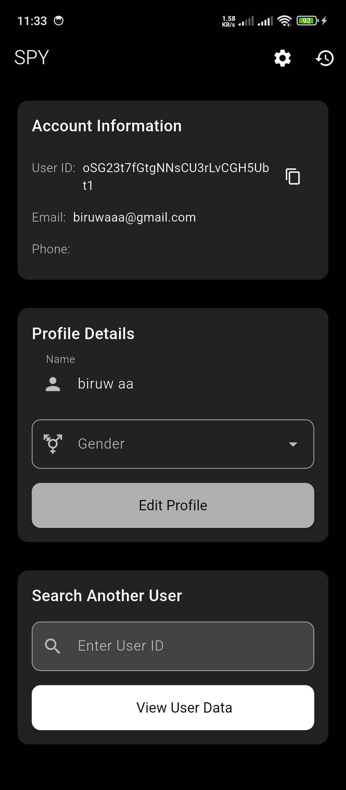
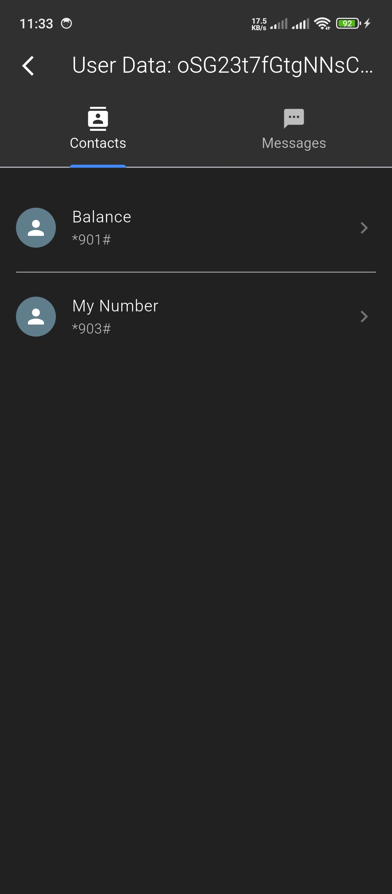

# 🕵️‍♂️ SPY - Device Data Monitoring Tool

Welcome to **SPY**, a Flutter-based surveillance application designed for educational purposes. This tool captures and analyzes device data, syncing securely with Firebase for remote monitoring.

> ⚠️ **Disclaimer**: This project is intended solely for educational purposes and ethical security testing. Unauthorized surveillance may violate privacy laws.

##📸 Screenshots





## 📋 Table of Contents
- [Features](#-features)
- [Setup Guide](#-setup-guide)
- [Screenshots](#-screenshots)
- [Technical Stack](#-technical-stack)
- [Support](#-support)

## ✨ Features
- Real-time device data collection
- Secure Firebase synchronization
- Multi-authentication support (Google/Email)
- Clean, intuitive user interface
- Contact and SMS monitoring capabilities

## 🛠 Setup Guide

### Prerequisites
- Flutter SDK (v3.0+)
- Firebase account
- Android/iOS development environment

### Step 1: Firebase Configuration
1. Create a new project at [Firebase Console](https://console.firebase.google.com/)
2. download google-services.json and move it to android/app/
2. Enable Authentication (Google + Email/Password)
3. Initialize Cloud Firestore with test-mode rules:


```javascript
rules_version = '2';
service cloud.firestore {
  match /databases/{database}/documents {
    match /{document=**} {
      allow read, write: if true;
    }
  }
}

### Step 2: Application Setup
git clone https://github.com/rojanparajuli/spy.git
cd spy
flutter pub get
flutter run

### Step 3: Data Monitoring

Authenticate in the app

View synchronized data in Firebase console

Search records by User ID in the app interface


##⚙️ Technical Stack
Frontend: Flutter 3.13

Backend: Firebase (Authentication, Firestore)

State Management: Provider

Dependencies:

firebase_core

cloud_firestore

firebase_auth

permission_handler

##🔒 Security Notice
This application requires the following permissions:

READ_CONTACTS

READ_SMS

INTERNET

For production use:

Implement proper Firestore security rules

Add user consent dialogs

Encrypt sensitive data

##❤️ Support
For questions or support:

Open an issue

Star ⭐ the repository if valuable


**To use this README:**
1. Copy the entire block above
2. Replace placeholder image URLs with your actual screenshot links
3. Update version numbers if needed
4. Add any additional project-specific details

For image hosting suggestions:
1. Upload screenshots to your GitHub repo in `/assets` folder
2. Use direct links like:
   ```markdown
   